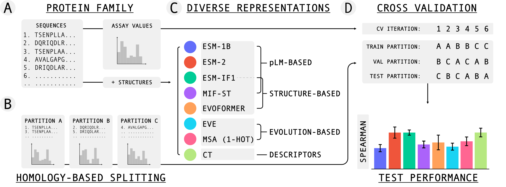
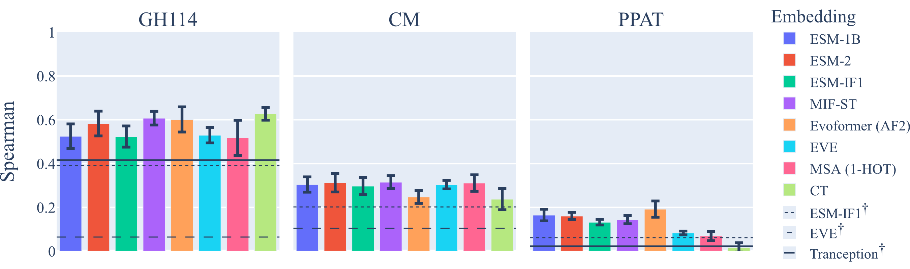
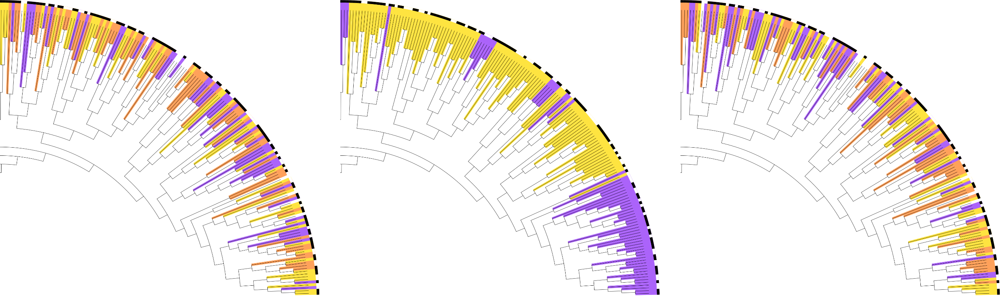

# FLOP: Tasks for Fitness Landscapes Of Protein wildtypes

This is the official code repository for the paper _FLOP: Tasks for Fitness Landscapes Of Protein wildtypes_ by Groth et al. (2023) [LINK_TO_PAPER] which is currently under review.

### Abstract
Protein engineering has the potential to create optimized protein variants with improved properties and function. An initial step in the protein optimization process typically consists of a search among natural (wildtype) sequences to find the naturally occurring proteins with the most desirable properties. Promising candidates from this initial discovery phase then form the basis of the second step: a more local optimization procedure, exploring the space of variants separated from this candidate by a number of mutations. While considerable progress has been made on evaluating machine learning methods on single protein datasets, benchmarks of data-driven approaches for global fitness landscape exploration are still lacking. In this paper, we have carefully curated a representative benchmark dataset, which reflects industrially relevant scenarios for the initial wildtype discovery phase of protein engineering. We focus on exploration within a protein family, and investigate the downstream predictive power of various protein representation paradigms, i.e., protein language model-based representations, structure-based representations, and evolution-based representations. Our benchmark highlights the importance of coherent split strategies, and how we can be misled into overly optimistic estimates of the state of the field. 

### Overview

<p align="center">
    
</p>

_Caption_: Schematic over dataset splitting, representations, and cross validation process.
    A: A dataset with sequences from a single protein family and corresponding assay values is curated. 
    B: A stratified sequence identity splitting procedure generates partitions A, B, and C, which are (1) homologically different from each other, (2) contain similar number of sequences, and (3) match the full dataset's target distribution. 
    C: Eight types of protein representations are computed. 
    D: Cross-validation using a random forest regressor is applied to obtain mean values and standard errors on the test partitions.

### Dataset overview

A summary of the curated datasets including their total sizes, partition sizes, between-partition sequence identity threshold (Split %ID), target value, median pair-wise sequence identity, and average sequence length can be seen in the table below.
For comparison, in existing mutational fitness landscape datasets (i.e., for the local optimization phase), the median sequence identity is often close to 1.0 as all sequences are at pairwise Hamming distances of 1 (in the case of single mutants). 
The low median sequence identity observed here highlights the diversity -- and difficulty -- of wildtype datasets. 

|                | $N_{tot}$ | $N_A$ | $N_B$ | $N_C$ | Split %ID | Target   | Median %ID | Avg. length | Source |
|----------------|-------|-----|-----|-----|------------|----------|------------|-------------|---------------|
| GH114          | 53    | 20  | 18  | 17  | 0.55       | Activity | 0.46       | 268.8       |[Link](https://patentscope.wipo.int/search/en/detail.jsf?docId=WO2019228448)|
| CM             | 855   | 341 | 259 | 255 | 0.40       | Activity | 0.40       | 91.1        |[Link](https://www.science.org/doi/full/10.1126/science.aba3304)|
| PPAT           | 615   | 182 | 234 | 199 | 0.55       | Fitness  | 0.51       | 161.6       |[Link](https://www.science.org/doi/10.1126/science.aao5167) |

### Benchmark results

<p align="center">
    
</p>


_Caption_: Average Spearman's rank correlation (and standard error) between predictions and targets over test partitions. Higher is better. $^\dagger$: Zero-shot correlations.

### Phylogenetic tree for PPAT dataset

<p align="center">
    
</p>

_Caption_: The same segment of a phylogenetic tree for the PPAT dataset. Branch color corresponds to its CV partition, while the outermost ring shows the target values (black indicates high and white indicates low values). The segments highlight the diversity found in wildtype protein families. Left: entries are colored according to the prescribed dataset splitting procedure which allows learning across subfamilies (indicated by the mix of colors). Middle: entries are colored by a clustering approach leading to wide regions, disallowing learning across subfamilies. Right: entries are randomly assigned a color. While similar to the leftmost scheme, the random coloring allows near identical sequences to be placed in separate partitions leading to excessive data-leakage.

## Installation
After cloning this repository, an environment can be built directly via

```bash
conda env create -f flop.yml
```

### Optional dependencies
The generation of protein representations relies on various codebases.

#### ESM
To generate *Evolutionary Scale Modeling* representations from https://github.com/facebookresearch/esm, install 

```bash
pip install fair-esm
```
#### EVE 
To generate EVE-based representations from https://github.com/OATML-Markslab/EVE, clone and install the repository locally.
Note, the function `EVE/utils/data_utils.py` function has been altered to work with the wildtype query sequence. This file is therefore included in this repository.

#### MIF-ST 
To generate MIF-ST representations from https://github.com/microsoft/protein-sequence-models, install

```bash
pip install sequence-models
```

#### Tranception
For unsupervised Tranception scoring from https://github.com/OATML-Markslab/Tranception, clone and install the repository locally.

#### PyBioMed
For compositional/transitional representation generation from https://github.com/gadsbyfly/PyBioMed, clone and install the repository locally.

## Accessing data, representations, and models
The curated data, i.e., the main benchmark data, can be found in the `data/processed/` directory in this repository. A description of what each datafile contains can be seen below.

The full datasets, computed representations, and trained EVE models are hosted at the _Electronic Research Data Archive_ (ERDA) by the University of Copenhagen.
This can be accessed at https://sid.erda.dk/cgi-sid/ls.py?share_id=HLXs3e9yCu, which allows for either downloading three tar-files (data, models, representations) or individual files.
The directory structure of the tar-files can be found at the bottom of this readme under **Project organization**.

**Datasets**: Includes `raw` data (e.g., original csv-files, pdb-files for all sequences, FASTA-files etc.), `interim` data (e.g., files generated during curation), and `processed` data which is the cleaned csv-files with protein ids, sequence, target values, stratification label, and partition indicators. A snippet of the processed GH114 file can be seen here:

| index | name     | sequence         | target_reg | target_class | part_0 | part_1 | part_2 |
|-------|----------|------------------|------------|--------------|--------|--------|--------|
| 0     | SEQ_ID_3 |  APLPSPHSQVKDV... | 1.47    | 0            | 1      | 0      | 0      |
| 1     | SEQ_ID_12 | AVPAPPPAGAGFD... | 0.36    | 1            | 1      | 0      | 0      |
| 2     | SEQ_ID_18 | KPATAARATGLAD... | 0.60    | 1            | 0      | 1      | 0      |
| 3     | SEQ_ID_21 | AAVTLPPTHAGFD... | 0.72   | 1            | 1      | 0      | 0      |

In the above, the first, second, and fourth proteins belong to the first cross-validation partition (1 in `part_0` column), while the third belongs to the second partition (1 in the `part_1` column). All datasets follow the above structure. The partition columns can easily be converted into either boolean masks for quick indexing or a single column with integer values specifying the partition.

The structures for all proteins have been predicted using AlphaFold2 (Jumper et al. (2021), https://doi.org/10.1038/s41586-021-03819-2) and ColabFold (Mirdita et al. (2022), https://doi.org/10.1038/s41592-022-01488-1), using five recycling runs with early stopping at pLDDT of 90.0.

**Models**: Includes the trained EVE models for each dataset, where each dataset has three models in total (trained with different random seeds). Other pre-trained models, e.g., ESM-models, should be extracted from their original sources and placed in the `models` directory.

**Representations**: Includes all the generated partitions in their original formats.

## Note on data
The used datasets are curated versions of three publicly available datasets:
- GH114 was extracted with permission from the inventors from the WO2019228448 patent which can be accessed at https://patentscope.wipo.int/search/en/detail.jsf?docId=WO2019228448 or alternatively at https://patents.google.com/patent/WO2019228448A1/en. 
- CM was extracted from the supplementary materials of _An evolution-based model for designing chorismate mutase enzymes_ by Russ et al (2020), which can be accessed at https://www.science.org/doi/full/10.1126/science.aba3304.
- PPAT was extracted from the supplementary materials of _Multiplexed gene synthesis in emulsions for exploring protein functional landscapes_ by Plesa et al. (2018), which can be accessed at https://www.science.org/doi/10.1126/science.aao5167.

## Reproducing the results

```bash
# Process and split datasets
bash scripts/compile_dataset.sh

# Run cross-validation and ablation studies
bash scripts/reproduce.sh

# Process results and generate figures
bash scripts/process_results.sh

# Re-train EVE [optional]
bash scripts/train_EVE_models.sh

# Generate representations. Requires optional dependencies. [optional]
bash scripts/generate_representations.sh

# Compute Tranception scores [optional]
bash scripts/comptue_tranception_scores.sh


```

## Adding new representations
To run the setup on a novel representation, a directory should be created for each dataset: `./representations/$dataset/new_representation`, in which all the representation of each sequence is saved as individual files (following the current convention).

A new `if`-option should then be added to the `extract_all_embeddings`-function in `./src/data/data_utils.py`, which follows the convention present of sequentially loading all representations and saving them in a numpy array.

This representation can then be benchmarked for a dataset by running:

```bash
python src/training/fit_model.py --dataset dataset --embedding_types "new_representation"
```

The results can be processed, saved, and visualized with

```bash
python src/process_results.py --dataset dataset --save_csv --bar_plot --embedding_types "new_representation"
```

NOTE: This might overwrite existing figures/result files, depending on the included representations. 


## Recreate phylogenetic trees
To recreate the included phylogenetic trees from the manuscript, run the following 
```bash
bash scripts/generate_phylogenetic_trees.sh
bash scripts/mmseqs_clustering.sh ppat
python src/visualization/visualize_phylo_tree.py --dataset ppat
```
This procedure generates a tree using FastTree (www.microbesonline.org/fasttree/). 
The tree is visualized with three different coloring-schemes; one according to the CV partitions prescribed in the manuscript, one according to an MMseqs-clustering, and one random coloring corresponding to random splitting.
The following dependencies are introduced: 
- csvtk for handling csv/tsv files (https://bioinf.shenwei.me/csvtk/)
- FastTree for tree generation (www.microbesonline.org/fasttree/)
- SeqKit for handling MSAs (https://bioinf.shenwei.me/seqkit/)
- ETE Toolkit for tree visualization (http://etetoolkit.org/)
- MMseqs2 for clustering (https://github.com/soedinglab/MMseqs2)


## Project organization
------------

    ├── data/
    │   ├── interim/                # Files used in splitting, representation creating etc.
    │   │   ├── cm/                        
    │   │   ├── gh114/                        
    │   │   ├── ppat/                        
    │   │   └── eve_mappings.csv    # File for training EVE                      
    │   │                    
    │   ├── processed/              # Cleaned CSV-files with ids, sequences, targets, splits.
    │   └── raw/                    # Raw data files. 
    │
    ├── EVE/utils/data_utils.py     # Altered file from EVE to work well with wildtype query sequence
    │
    ├── figures/                    # Various figures used in the manuscript
    │
    ├── models/                     # Location for pretrained/trained models (ESM, Tranception, EVE)
    │   ├── EVE/                
    │   │   ├── cm/                        
    │   │   ├── gh114/                                                
    │   │   └── ppat/                    
    │   │                    
    │   ├── ...
    │   └── ...
    │
    ├── representations/
    │   ├── cm/    
    │   │   ├── af2/                        
    │   │   ├── ct/                         
    │   │   ├── esm_1b/                     
    │   │   ├── esm_2/                      
    │   │   ├── esm_if1/                    
    │   │   ├── eve/                         
    │   │   │   ├── 0/                      # EVE with seed 0 (1 file per sequence)
    │   │   │   ├── 1/                      # EVE with seed 1 (1 file per sequence)
    │   │   │   └── 2/                      # EVE with seed 2 (1 file per sequence)
    │   │   │
    │   │   ├── mifst/
    │   │   ├── onehot/
    │   │   ├── cm_EVE_ELBO_0.csv           # ELBOs for EVE with seed 0 
    │   │   ├── cm_EVE_ELBO_1.csv           # ELBOs for EVE with seed 1 
    │   │   ├── cm_EVE_ELBO_2.csv           # ELBOs for EVE with seed 2 
    │   │   ├── cm_tranception_scores.csv   # Tranception scores
    │   │   └── esm_if1_likelihoods.csv     # ESM-IF1 structured-conditioned likelihoods
    │   │
    │   ├── gh114/
    │   │   └── ...
    │   │
    │   └── ppat/   
    │       └── ...
    │
    ├── results/
    │
    ├── scripts/     # Shell scripts to run experiments and generate figures
    │   ├── compile_datasets.sh             # Compile all three datasets
    │   ├── compute_median_seq_id.sh        
    │   ├── compute_tranception_scores.sh   
    │   ├── generate_MSAs.sh                
    │   ├── generate_phylogenetic_trees.sh  # Comp. (and visualize) phylogenetic tree based on MSA
    │   ├── generate_representations.sh     # Gen. representations
    │   ├── mmseqs_clustering.sh            
    │   ├── process_results.sh              # Process results and generate all figures
    │   ├── reproduce.sh                    # Run all experiments
    │   └── train_EVE_models.sh             # Train EVE, compute ELBOs, and extract latents for all datasets
    │
    ├── src/        
    │   ├── __init__.py
    │   ├── process_results.py   # Script to process results and print $\latex$-formated tables
    │   ├── visualize_results.py # Script to generate visualization of CV results + ablation
    │   │
    │   ├── data/       
    │   │   ├── __init__.py
    │   │   ├── compile_cm.py       # Compilation of cm dataset         
    │   │   ├── compile_dataset.py  # Compilation of general datasets [for new data]
    │   │   ├── compile_gh114.py    # Compilation of gh114 dataset
    │   │   ├── compile_ppat.py     # Compilation of ppat dataset
    │   │   └── data_utils.py       
    │   │
    │   ├── representations/ 
    │   │   ├── __init__.py
    │   │   ├── compute_esm_if1_lls.py              # Comp. ESM-IF1 sequence likehoods (given structure)
    │   │   ├── compute_eve_elbos.py                # Comp. EVE ELBOs (given trained EVE)
    │   │   ├── compute_tranception_scores.py        
    │   │   ├── generate_ct_representations.py      
    │   │   ├── generate_esm_if1_representations.py 
    │   │   ├── generate_esm_representations.py     
    │   │   ├── generate_eve_query.py               # Gen. query sequence for training EVE
    │   │   ├── generate_eve_representations.py     # Gen. latent EVE representation (given trained EVE)
    │   │   ├── generate_mifst_representations.py   
    │   │   ├── generate_onehot_representations.py  # Gen. (flattened) onehot-representation  (given MSA)
    │   │   └── train_EVE.py                        # Modified script to train EVE models. Adapted from 
    │   │                                           # https://github.com/OATML-Markslab/EVE/blob/master/train_VAE.py
    │   │
    │   ├── training/
    │   │   ├── __init__.py
    │   │   ├── compute_unsupervised_correlations.py    # Comp. (unsupervised) Spearman correlations for EVE ELBOs, 
    │   │   │                                           # ESM-IF1 likelihoods and Tranception scores
    │   │   ├── fit_model.py                            # Run CV for a dataset (+ ablation studies)
    │   │   └── training_utils.py                       
    │   │
    │   └── visualization/
    │       ├── __init__.py
    │       ├── generate_additional_figures.py 
    │       ├── generate_histograms.py                  
    │       ├── visualization_funcs.py                  
    │       └── visualize_phylo_tree.py                 
    │
    ├── LICENSE
    ├── README.md     
    └── flop.yml   # Project dependencies. Create environment with conda. To recreate representations, additional 
                   # repos are required.
    

--------
